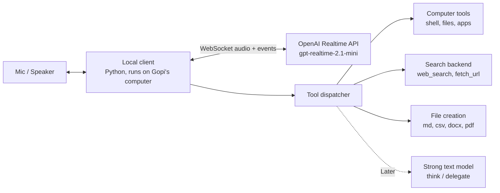
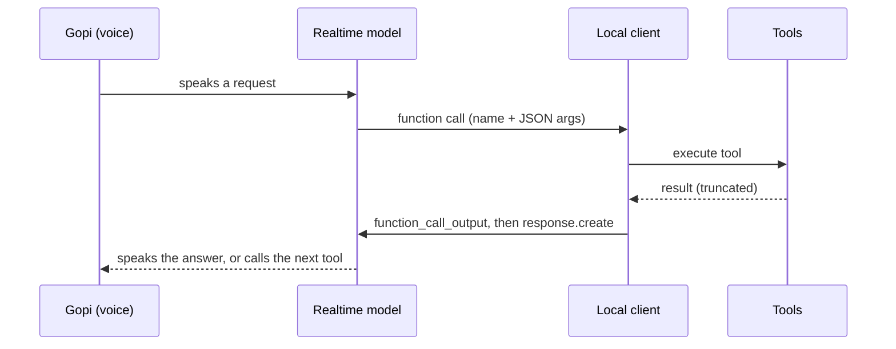

# Gopi's Speech-to-Speech Bot: Architecture & Workflow

**Goal:** A voice assistant that talks in real time, can operate Gopi's whole computer, searches the web and reports back, carries out whatever it's asked, and creates files (Markdown, PDF, Word, CSV, and more), similar to Grok Bot.

**Build window:** 1 hour for v1. Everything marked **Later** is out of scope for the first hour.

---

## 1. Specs (as stated)

| Area | Requirement |
|---|---|
| Voice | Speech-to-speech on the OpenAI Realtime API, version 2.1 (`gpt-realtime-2.1-mini`), about $0.20 per 15 min |
| Computer access | Full access to Gopi's machine through tools |
| Web | Search the internet, research, and bring back results |
| Actions | If asked to do something, it does it |
| Files | Create Markdown, PDF, Word, CSV, or any other requested format |

---

## 2. Architecture at a glance

Four layers:

1. **Realtime voice layer.** Handles listening, turn-taking, and speaking.
2. **Function-calling tool layer.** Covers computer access and file creation.
3. **Search backend.** Web search and page fetching.
4. **Agent loop.** Routes the model's tool calls to real functions and feeds the results back.

---

## 3. Realtime voice layer (v1)

- The local Python client opens a WebSocket to the Realtime API and sends `session.update` with instructions, voice, server-side voice activity detection, and the tool list.
- Mic audio streams up as PCM16 chunks, and the model's audio streams back to the speaker.
- **Barge-in:** when the user starts talking, stop playback and cancel the current response.
- The system prompt covers persona, "act, don't ask, except for destructive actions", keeping spoken replies short, and saying "working on it" before slow tools.

---

## 4. Tool layer: computer access and files (v1)

| Tool | What it does | v1 / Later |
|---|---|---|
| `run_shell(cmd, cwd)` | Runs a shell command and returns stdout, stderr, and exit code (with a timeout) | v1 |
| `read_file(path)` | Reads a text file, truncated to a safe size | v1 |
| `write_file(path, content)` | Creates or overwrites a text file | v1 |
| `list_dir(path)` | Lists a folder | v1 |
| `open_path(path_or_app)` | Opens a file, folder, URL, or app with the OS default | v1 |
| `create_document(format, title, content)` | Writes md or csv directly, docx via `python-docx`, pdf via `pandoc` or `reportlab` | v1 (md, csv, docx, pdf) |
| `screenshot()` / mouse and keyboard control | Lets the bot see and drive GUI apps | Later |
| `think(question)` | Hands hard reasoning to a strong text model | Later |
| `codex_task(prompt)` | Runs a long coding job in the background with Codex | Later |

**Guardrails (v1, minimal):** destructive commands (`rm`, `format`, deleting files, sending messages, purchases) need a spoken "yes" first. Log every tool call to `bot.log`. Cap output size returned to the model.

---

## 5. Search backend (v1)

- `web_search(query)` calls a search API (Tavily or Brave for the fastest setup, or OpenAI's Responses API with its web search tool) and returns the top results as title, URL, and snippet.
- `fetch_url(url)` downloads a page, strips it to readable text, and truncates it.
- For research requests, the bot searches, fetches two or three pages, speaks a short summary, and offers to save a full report with `create_document`.
- **Later:** a `deep_research(topic)` tool that runs a multi-step search loop with a strong text model and writes a cited report.

---

## 6. Agent loop (v1)

1. The model decides to call a tool, and the client receives the completed function-call arguments.
2. The dispatcher looks up the tool by name, validates the args, and runs it with a timeout.
3. The client sends the result back as a `function_call_output` item, then requests a new response.
4. The model chains more tools or speaks the result. The loop repeats until the task is done.
5. **Slow tasks (Later):** the tool returns "started" right away, runs in the background, and when it finishes the client injects the result into the conversation so the bot can announce it.

---

## 7. Step-by-step build plan (v1, one-hour window)

All five steps are **v1** and are meant to fit in a single one-hour build. If a step runs over, cut scope (log it in `TODO.md`) rather than skip testing. Anything not listed here is in section 8 (Later).

### Step 1: Stand up the Realtime 2.1 mini voice session (~10 min, 0:00–0:10)
- Get an OpenAI API key and $5 prepaid credit. Install `websockets`, `sounddevice`, `numpy`, `requests`, and `python-docx`.
- Open a WebSocket to the Realtime API with `gpt-realtime-2.1-mini` and send `session.update` with the system prompt, voice, and server-side voice activity detection.
- Stream mic audio up as PCM16 and play the model's audio back. Add barge-in, so playback stops when Gopi talks.
- **Done when:** you can hold a spoken back-and-forth conversation.

### Step 2: Wire the tool-calling layer for computer access (~15 min, 0:10–0:25)
- Register tool schemas in `session.update`: `run_shell`, `read_file`, `write_file`, `list_dir`, `open_path`.
- Build the dispatcher. When a function call's arguments are complete, run the matching Python function with a timeout and truncate its output. Send the result back as `function_call_output`, then call `response.create`.
- Add the guardrail: destructive commands need a spoken "yes" first, and every call is logged to `bot.log`.
- **Done when:** "list what's on my desktop" and "open my Downloads folder" both work by voice.

### Step 3: Add file creation for Markdown, PDF, Word, CSV (~10 min, 0:25–0:35)
- Add a `create_document(format, path, title, content)` tool.
- Write Markdown and CSV directly, Word via `python-docx`, and PDF via `pandoc` (or `reportlab` if pandoc isn't installed).
- **Done when:** "make a CSV of my three to-dos and a Word doc summary" creates both files.

### Step 4: Hook up web search (~10 min, 0:35–0:45)
- Add a `web_search(query)` tool that calls Tavily or Brave and returns title, URL, and snippet for the top results.
- Add a `fetch_url(url)` tool that returns readable page text, truncated.
- Update the prompt: for research, search, read two or three pages, give a short spoken summary, and offer to save a report.
- **Done when:** "what's the latest on X?" returns a spoken, sourced answer.

### Step 5: Test the full loop end to end (~15 min, 0:45–1:00, protected)
- Run one chained task: "Research X, save a Word report to my desktop, and open it."
- Check barge-in during a long answer, the confirmation prompt on a destructive command, and a tool timeout or error.
- Check `bot.log` and the OpenAI usage page to confirm tool calls and cost (about $0.20 per 15 minutes).
- **Done when:** the chained task works hands-free with no manual fixes.

---

## 8. Later (after v1)

- Screen vision plus mouse and keyboard control for GUI apps
- `think` tool backed by a strong text model, since the mini voice model reasons poorly alone
- Codex as a background coding worker
- Background jobs with spoken completion notices
- A VM or sandbox for risky actions instead of the host machine
- Memory across sessions (a notes file loaded into instructions)
- A phone or remote client (web page over Tailscale)
- Cost dashboard that tracks minutes and tokens per session

---

## 9. Risks to keep in mind

- **Full computer access is powerful.** Keep the confirmation step for anything destructive or outward-facing.
- **Mini model reasoning is weak.** Complex multi-step tasks will be unreliable until the `think` tool lands.
- **Long tool outputs eat context and cost.** Always truncate before returning results to the model.
